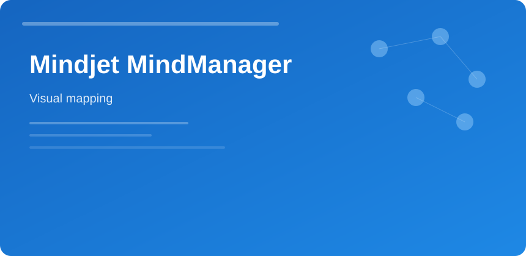

  

  

# Mindjet MindManager

Turn whiteboard chaos into **maps → timelines → task lists** without retyping everything.

### Map types

- Radial brainstorm
- Flowchart for processes
- Org chart from CSV
- Gantt view when dates matter

### Integrations

| Target | Flow |
|--------|------|
| Word/PPT | Export outline |
| Excel | Task table sync |
| SharePoint | Publish read-only |

### Facilitation tip

One central topic per meeting; use icons for status instead of color alone for accessibility.

mindjet mindmanager mind map planning diagrams productivity
